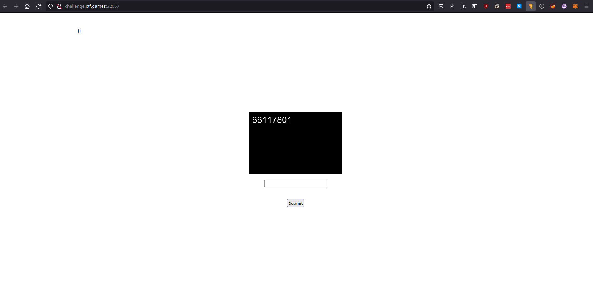

# OTP Smasher


OTP stands for [One Time Pad](https://en.wikipedia.org/wiki/One-time_pad). A OTP uses modular arithmetic to rotate plain text with the characters of a key. You cast the letters of the key over the plain text, repeatedly, and add the positions in the "alphabet" of the characters together, and use the new number you have to select a new character (you have to mod this by the number of characters you have). This system can work with any set of symbols, not just letters. When done correctly, OTPs are unbreakable in theory as it can be infeasible to guess and check every possible combination of key letters.



It's clear that we need to type this number into the box and hit submit. This challenge is in the ```scripting``` category, so we will probably need to do it many times, quickly. In the HTML, I found reference to the file ```/static/flag.png```, but got a 404 when I tried to visit it.


We need to write code to do [optical character recognition](https://en.wikipedia.org/wiki/Optical_character_recognition) on the image, and submit the number repeatedly. We can use [pytesseract](https://pypi.org/project/pytesseract/) to get the numbers, and [requests](https://docs.python-requests.org/en/latest/) to submit them.

```python
"""
Your fingers too slow to smash, tbh. 
"""

import pytesseract
from time import sleep
from PIL import Image
import requests


for i in range(3):
    # Download
   
    response = requests.get("http://challenge.ctf.games:30184/static/otp.png")

    file = open("otp.png", "wb")
    file.write(response.content)
    file.close()
    
    # Get text
    text = pytesseract.image_to_string(Image.open("otp.png"), lang='eng', config='digits').strip()
    print(text)

    #sleep(1)
    mykey = {'otp_entry' : text}
    #print(mykey)
    r = requests.post("http://challenge.ctf.games:30184/",data = mykey)

    
response = requests.get("http://challenge.ctf.games:30184/static/flag.png")
file = open("flag.png", "wb")
file.write(response.content)
file.close()

# Get text
text = pytesseract.image_to_string(Image.open("flag.png"), lang='eng').strip()
```

