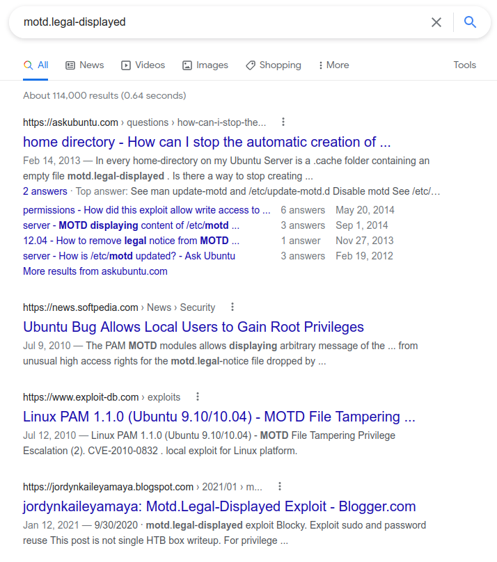
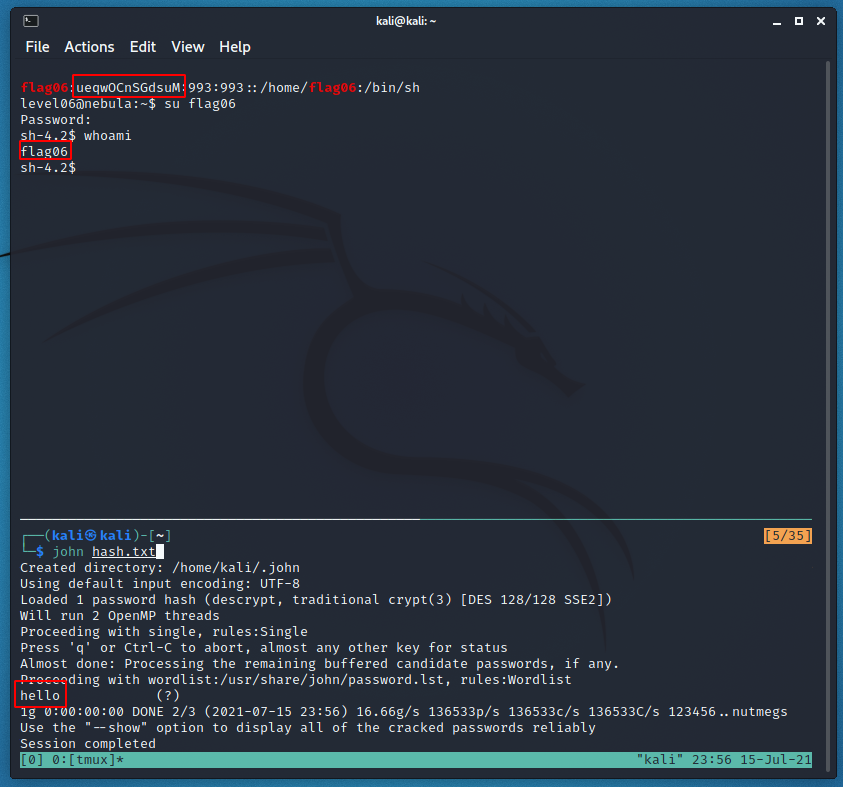

# Level 06 - Nebula

```
The flag06 account credentials came from a legacy unix system.

To do this level, log in as the level06 account with the password level06. Files for this level can be found in /home/flag06.
```

The only thing that stands out here is the empty "motd.legal-displayed" file inside of the .cache directory.

```bash
level06@nebula:~$ ls -laR
.:
total 5
drwxr-x--- 1 level06 level06   60 2021-07-15 19:17 .
drwxr-xr-x 1 root    root     100 2012-08-27 07:18 ..
-rw-r--r-- 1 level06 level06  220 2011-05-18 02:54 .bash_logout
-rw-r--r-- 1 level06 level06 3353 2011-05-18 02:54 .bashrc
drwx------ 2 level06 level06   60 2021-07-15 19:17 .cache
-rw-r--r-- 1 level06 level06  675 2011-05-18 02:54 .profile

./.cache:
total 0
drwx------ 2 level06 level06 60 2021-07-15 19:17 .
drwxr-x--- 1 level06 level06 60 2021-07-15 19:17 ..
-rw-r--r-- 1 level06 level06  0 2021-07-15 19:17 motd.legal-displayed
```

The challenge hints that the, "the flag06 account credentials came from a legacy unix system." This means that the vulnerability relating to the motd file is probably well known and documented. A google search verifies this.



After this search I tried using the [exploit-db script](https://www.exploit-db.com/exploits/14339) but it didn't work. We need to dig deeper.

At this point a friend of mine (who was working on nebula as well) accidentally spoiled that they noticed the password hash for flag06 was stored in the the /etc/passwd (something that used to be normal, i.e on a **legacy system**). This classic flaw had occurred to be when I started but I got sucked into the motd rabbit hole.

Now we just need to grab the hash and crack it to login.

