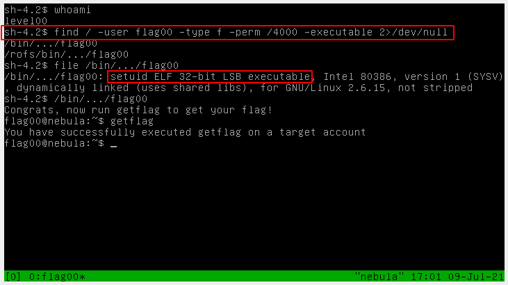

# [Level 00](https://exploit.education/nebula/level-00/) - Nebula

```
This level requires you to find a Set User ID program that will run as the “flag00” account. You could also find this by carefully looking in top level directories in / for suspicious looking directories.

Alternatively, look at the find man page.
```

Set User Id, setuid, or SUID is an access rights flag that allows a user to run a file with the permissions of another user. This can become a vulnerability when unintended users have unintended extended permissions, and in the worst case scenario an attacker could use a SUID flag to escalate their privileges.

All SUID files on a system can be found like so:

```bash
find / -type f -perm /4000 2>/dev/null
```

Once you find an SUID file your next step is to figure out how to exploit it. This isn't part of the challenge here, but in the real world [GTFOBins](https://gtfobins.github.io/) is a helpful resource for this.

