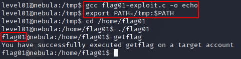

# Level 01 - Nebula

```
There is a vulnerability in the below program that allows arbitrary programs to be executed, can you find it?

To do this level, log in as the level01 account with the password level01. Files for this level can be found in /home/flag01.
```

```c
#include <stdlib.h>
#include <unistd.h>
#include <string.h>
#include <sys/types.h>
#include <stdio.h>

int main(int argc, char **argv, char **envp)
{
  gid_t gid;
  uid_t uid;
  gid = getegid();
  uid = geteuid();

  setresgid(gid, gid, gid);
  setresuid(uid, uid, uid);

  system("/usr/bin/env echo and now what?");
}
```

A few things about this program stand out. It uses the types gid_t and uid_t from the unistd.h header file, which stand for [group id and user id](https://en.wikipedia.org/wiki/User_identifier) respectively. This program is reading what the process's [real](https://en.wikipedia.org/wiki/User_identifier#Process_attributes) group and user ids are from the system with the [getegid()](https://linux.die.net/man/2/getegid) & [geteuid()](https://linux.die.net/man/2/geteuid) functions and then setting the process's real, effective, and saved IDs to those values with the [setresgid()](https://linux.die.net/man/2/setresgid) and [setresuid()](https://linux.die.net/man/2/setresgid) functions. This is interesting because it allows us to run any executable this file runs as the owner of that file.

Finally, the program calls the [system function](https://linux.die.net/man/3/system), which executes a shell command:

```c
system("/usr/bin/env echo and now what?");
```

The [/usr/bin/env](https://en.wikipedia.org/wiki/Env) is running the echo command which is binded to the system [path](https://en.wikipedia.org/wiki/PATH_(variable)). The vulnerability here lies in the fact that "echo" is relative to the system path, which we have permissions to alter. Had this program instead been using the absolute path of /usr/bin/echo, it wouldn't be vulnerable.

We can create and compile a c program to give us a shell:

```c
#include <stdlib.h>

int main() {
  system("bash");
}
```

We can then exploit the system and get out flag!

