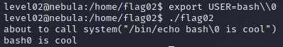

# Level 02 - Nebula

```
There is a vulnerability in the below program that allows arbitrary programs to be executed, can you find it?

To do this level, log in as the level02 account with the password level02. Files for this level can be found in /home/flag02.
```

```c
#include <stdlib.h>
#include <unistd.h>
#include <string.h>
#include <sys/types.h>
#include <stdio.h>

int main(int argc, char **argv, char **envp)
{
  char *buffer;

  gid_t gid;
  uid_t uid;

  gid = getegid();
  uid = geteuid();

  setresgid(gid, gid, gid);
  setresuid(uid, uid, uid);

  buffer = NULL;

  asprintf(&buffer, "/bin/echo %s is cool", getenv("USER"));
  printf("about to call system(\"%s\")\n", buffer);
  
  system(buffer);
}
```

This challenge is quite simmilar to the last, and the most notable difference is that instead of using "/usr/bin/env echo" the program is using the [absolute](https://en.wikipedia.org/wiki/Path_(computing)#Absolute_and_relative_paths) path of "/bin/echo". This means that we wont be able to abuse a path variable or swap the file here, as we don't have perms to edit programs under /bin.

The program creates buffer, an array of chars and passes it to the [asprintf()](https://linux.die.net/man/3/asprintf) function, which simply formats a string in the same way that printf() would and saves it to a variable.

```c
asprintf(&buffer, "/bin/echo %s is cool", getenv("USER"));
```

Another interesting this about this line is that the the "USER" environment variable is formatted into the string. This is probably the vulnerability, as we can edit environment variables. We need to find some way to escape the normal string here and get the system() function below to give us a shell.

My first inclination was to try and put in a "\0", (C's [terminating character](https://stackoverflow.com/a/14461711)) to try and escape the array.



But this didn't work and C wasn't terminating on the \0.

The second thing we can try to escape is the [echo](https://linux.die.net/man/1/echo) command. Here we need to remember that the system() function is just running commands as we would on a terminal. In bash, semicolons separate commands, and allow the thing after them to run even if the thing before them fails. So we should be able to get a bash shell to run by passing:

```bash
export USER="t;bash"
```

to the USER environment variable.


