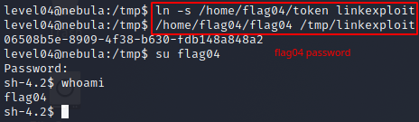

# Level 04 - Nebula

```
This level requires you to read the token file, but the code restricts the files that can be read. Find a way to bypass it :)

To do this level, log in as the level04 account with the password level04. Files for this level can be found in /home/flag04.
```

```c
#include <stdlib.h>
#include <unistd.h>
#include <string.h>
#include <sys/types.h>
#include <stdio.h>
#include <fcntl.h>

int main(int argc, char **argv, char **envp)
{
  char buf[1024];
  int fd, rc;

  if(argc == 1) {
      printf("%s [file to read]\n", argv[0]);
      exit(EXIT_FAILURE);
  }

  if(strstr(argv[1], "token") != NULL) {
      printf("You may not access '%s'\n", argv[1]);
      exit(EXIT_FAILURE);
  }

  fd = open(argv[1], O_RDONLY);
  if(fd == -1) {
      err(EXIT_FAILURE, "Unable to open %s", argv[1]);
  }

  rc = read(fd, buf, sizeof(buf));
  
  if(rc == -1) {
      err(EXIT_FAILURE, "Unable to read fd %d", fd);
  }

  write(1, buf, rc);
}
```

```bash
level04@nebula:/home/flag04$ ls
flag04  token
```

We need to read the token file, which we do not have perms on, with the ./flag04 binary. Variables fd, and rc are created, with fd standing for [file descriptor](https://en.wikipedia.org/wiki/File_descriptor) and rc representing the number of values returned later from read(). If the argc parameter equals 1, that means that no input was passed and the program exits with failure status.

The [strstr()](https://linux.die.net/man/3/strstr) inside of the next if condition returns a pointer to the position of the first occurrence of the word "token" in the first input (the filename), or NULL if no such string is found. This means that if the word "token" is present in the input, the program will exit. Otherwise, the program will open and read the token file for us. The goal of this challenge is passing input to the program that will get past the "token" filter and get the program to print whats inside the token file.

This can be achieved with a [symbolic link](https://en.wikipedia.org/wiki/Symbolic_link). Symbolic links point to a file with a different name. You can create a symbolic link like so:

```bash
ln -s target linkname
```

We need to create a symbolic link to /home/flag04/token in the /tmp directory (where we have write perms) and then pass that link as the input to ./flag04.

