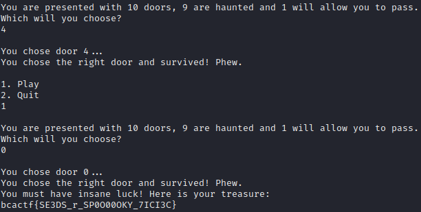

# Ghost Game

```
I love gaming in history class! This game is difficult to win though... I heard winning 10 times in a row leads to something good!
```

```python

##########    ##########    ##########    ##########    ##########
#        #    #        #    #        #    #        #    #        #
#        #    #        #    #        #    #        #    #        #
#     #  #    #     #  #    #     #  #    #     #  #    #     #  #
#        #    #        #    #        #    #        #    #        #
#        #    #        #    #        #    #        #    #        #
##########    ##########    ##########    ##########    ##########

### SO MANY DOORS, WHICH ONE TO CHOOSE??? ###

import random
FLAG = 'REDACTED'
REQ_WINS = 10
DOORS = 10
usr_choice = ''
random.seed(123049)
wins = 0
def play():
    comp_choice = random.randint(-10000, 10000)
    comp_choice %= DOORS
    print(comp_choice)
    print(f'\nYou are presented with {DOORS} doors, {DOORS - 1} are haunted and 1 will allow you to pass.')
    door_choice = int(input('Which will you choose?\n'))
    print(f'\nYou chose door {door_choice}...')
    return door_choice == comp_choice
print(f'Welcome to Ghost Game! Win {REQ_WINS} times in a row for your reward.')
while True:
    print('\n1. Play\n2. Quit')
    usr_choice = input()
    if usr_choice == '1':
        if play():
            print('You chose the right door and survived! Phew.')
            wins += 1
        else:
            print('That door had a ghost behind it. RIP.')
            wins = 0
    elif usr_choice == '2':
        break
    else:
        print('Invalid input.')
    if wins >= REQ_WINS:
        print('You must have insane luck! Here is your treasure:')
        print(FLAG)
```

The code asks us for a series or 10 "randomly generated" numbers which we have to enter in the correct order. Since we know what will be used to initialize the random number generator with [random.seed](https://docs.python.org/3/library/random.html#random.seed), we can just check what these values will be.

```python
import random
DOORS = 10
random.seed(123049)
for i in range(0, 10):
    comp_choice = random.randint(-10000, 10000)
    comp_choice %= DOORS
    print(comp_choice)
```

Which yields us

```
8
4
7
9
5
4
9
1
8
2
```


