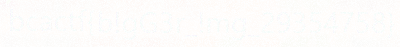
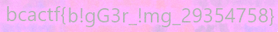

# Glassed Over - BCACTF 3.0

```
I created a new way to hide images, see if you can reverse it and find the flag.
    modifiedflag.png
    index.js
```

index.js

```javascript
const jimp = require('jimp');

async function main() {
    const image = await jimp.read('flag.png');
    const width = image.bitmap.width;
    const height = image.bitmap.height;
    
    image.scan(0, 0, width, height, (x, y, idx)=>{
        // var red = image.bitmap.data[idx];
        // var green = image.bitmap.data[idx + 1];
        // var blue = image.bitmap.data[idx + 2];
        // var alpha = image.bitmap.data[idx + 3];
        
        image.bitmap.data[idx+3] = Math.random() * 12;
        image.bitmap.data[idx+2] -= 129;
        image.bitmap.data[idx+1] -= 68;

        if (x == image.bitmap.width - 1 && y == image.bitmap.height - 1) {
            image.write("modifiedflag.png");
        }
    });

}
main();
```

modifiedflag.png



The program uses the [jimp](https://github.com/oliver-moran/jimp) library to change some data in ```flag.png``` and write it to ```modifiedflag.png```. We can solve this challenge well enough by just flipping some of the signs.

```javascript
const jimp = require('jimp');

async function main() {
    const image = await jimp.read('modifiedflag.png');
    const width = image.bitmap.width;
    const height = image.bitmap.height;

    image.scan(0, 0, width, height, (x, y, idx)=>{
        image.bitmap.data[idx-3] = Math.random() * 12;
        image.bitmap.data[idx-2] += 129;
        image.bitmap.data[idx-1] += 68;

        if (x == image.bitmap.width - 1 && y == image.bitmap.height - 1) {
            image.write("restoredflag.png");
        }
    });

}
main();
```

restoredflag.png

