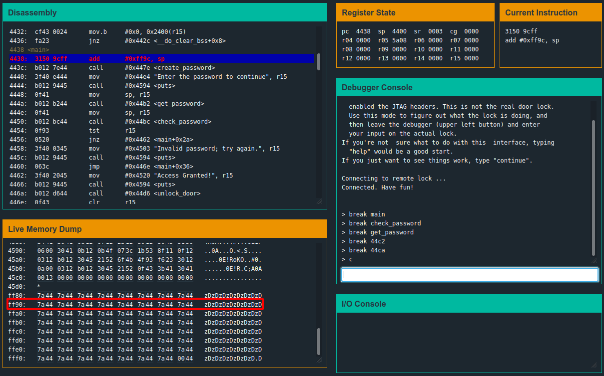
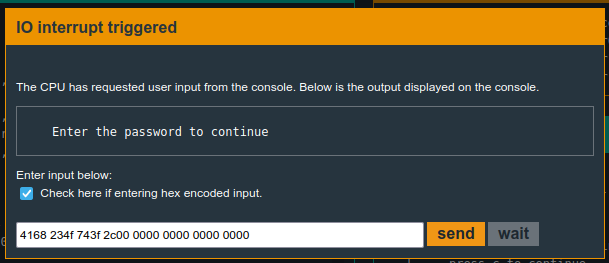

# New Orleans - Microcorruption


```assembly
0010 <__trap_interrupt>
0010:  3041           ret
4400 <__init_stack>
4400:  3140 0044      mov	#0x4400, sp
4404 <__low_level_init>
4404:  1542 5c01      mov	&0x015c, r5
4408:  75f3           and.b	#-0x1, r5
440a:  35d0 085a      bis	#0x5a08, r5
440e <__do_copy_data>
440e:  3f40 0000      clr	r15
4412:  0f93           tst	r15
4414:  0724           jz	#0x4424 <__do_clear_bss+0x0>
4416:  8245 5c01      mov	r5, &0x015c
441a:  2f83           decd	r15
441c:  9f4f c245 0024 mov	0x45c2(r15), 0x2400(r15)
4422:  f923           jnz	#0x4416 <__do_copy_data+0x8>
4424 <__do_clear_bss>
4424:  3f40 0800      mov	#0x8, r15
4428:  0f93           tst	r15
442a:  0624           jz	#0x4438 <main+0x0>
442c:  8245 5c01      mov	r5, &0x015c
4430:  1f83           dec	r15
4432:  cf43 0024      mov.b	#0x0, 0x2400(r15)
4436:  fa23           jnz	#0x442c <__do_clear_bss+0x8>
4438 <main>
4438:  3150 9cff      add	#0xff9c, sp
443c:  b012 7e44      call	#0x447e <create_password>
4440:  3f40 e444      mov	#0x44e4 "Enter the password to continue", r15
4444:  b012 9445      call	#0x4594 <puts>
4448:  0f41           mov	sp, r15
444a:  b012 b244      call	#0x44b2 <get_password>
444e:  0f41           mov	sp, r15
4450:  b012 bc44      call	#0x44bc <check_password>
4454:  0f93           tst	r15
4456:  0520           jnz	#0x4462 <main+0x2a>
4458:  3f40 0345      mov	#0x4503 "Invalid password; try again.", r15
445c:  b012 9445      call	#0x4594 <puts>
4460:  063c           jmp	#0x446e <main+0x36>
4462:  3f40 2045      mov	#0x4520 "Access Granted!", r15
4466:  b012 9445      call	#0x4594 <puts>
446a:  b012 d644      call	#0x44d6 <unlock_door>
446e:  0f43           clr	r15
4470:  3150 6400      add	#0x64, sp
4474 <__stop_progExec__>
4474:  32d0 f000      bis	#0xf0, sr
4478:  fd3f           jmp	#0x4474 <__stop_progExec__+0x0>
447a <__ctors_end>
447a:  3040 c045      br	#0x45c0 <_unexpected_>
447e <create_password>
447e:  3f40 0024      mov	#0x2400, r15
4482:  ff40 4100 0000 mov.b	#0x41, 0x0(r15)
4488:  ff40 6800 0100 mov.b	#0x68, 0x1(r15)
448e:  ff40 2300 0200 mov.b	#0x23, 0x2(r15)
4494:  ff40 4f00 0300 mov.b	#0x4f, 0x3(r15)
449a:  ff40 7400 0400 mov.b	#0x74, 0x4(r15)
44a0:  ff40 3f00 0500 mov.b	#0x3f, 0x5(r15)
44a6:  ff40 2c00 0600 mov.b	#0x2c, 0x6(r15)
44ac:  cf43 0700      mov.b	#0x0, 0x7(r15)
44b0:  3041           ret
44b2 <get_password>
44b2:  3e40 6400      mov	#0x64, r14
44b6:  b012 8445      call	#0x4584 <getsn>
44ba:  3041           ret
44bc <check_password>
44bc:  0e43           clr	r14
44be:  0d4f           mov	r15, r13
44c0:  0d5e           add	r14, r13
44c2:  ee9d 0024      cmp.b	@r13, 0x2400(r14)
44c6:  0520           jne	#0x44d2 <check_password+0x16>
44c8:  1e53           inc	r14
44ca:  3e92           cmp	#0x8, r14
44cc:  f823           jne	#0x44be <check_password+0x2>
44ce:  1f43           mov	#0x1, r15
44d0:  3041           ret
44d2:  0f43           clr	r15
44d4:  3041           ret
44d6 <unlock_door>
44d6:  3012 7f00      push	#0x7f
44da:  b012 3045      call	#0x4530 <INT>
44de:  2153           incd	sp
44e0:  3041           ret
44e2 <__do_nothing>
44e2:  3041           ret
44e4 .strings:
44e4: "Enter the password to continue"
4503: "Invalid password; try again."
4520: "Access Granted!"
4530 <INT>
4530:  1e41 0200      mov	0x2(sp), r14
4534:  0212           push	sr
4536:  0f4e           mov	r14, r15
4538:  8f10           swpb	r15
453a:  024f           mov	r15, sr
453c:  32d0 0080      bis	#0x8000, sr
4540:  b012 1000      call	#0x10
4544:  3241           pop	sr
4546:  3041           ret
4548 <putchar>
4548:  2183           decd	sp
454a:  0f12           push	r15
454c:  0312           push	#0x0
454e:  814f 0400      mov	r15, 0x4(sp)
4552:  b012 3045      call	#0x4530 <INT>
4556:  1f41 0400      mov	0x4(sp), r15
455a:  3150 0600      add	#0x6, sp
455e:  3041           ret
4560 <getchar>
4560:  0412           push	r4
4562:  0441           mov	sp, r4
4564:  2453           incd	r4
4566:  2183           decd	sp
4568:  3f40 fcff      mov	#0xfffc, r15
456c:  0f54           add	r4, r15
456e:  0f12           push	r15
4570:  1312           push	#0x1
4572:  b012 3045      call	#0x4530 <INT>
4576:  5f44 fcff      mov.b	-0x4(r4), r15
457a:  8f11           sxt	r15
457c:  3150 0600      add	#0x6, sp
4580:  3441           pop	r4
4582:  3041           ret
4584 <getsn>
4584:  0e12           push	r14
4586:  0f12           push	r15
4588:  2312           push	#0x2
458a:  b012 3045      call	#0x4530 <INT>
458e:  3150 0600      add	#0x6, sp
4592:  3041           ret
4594 <puts>
4594:  0b12           push	r11
4596:  0b4f           mov	r15, r11
4598:  073c           jmp	#0x45a8 <puts+0x14>
459a:  1b53           inc	r11
459c:  8f11           sxt	r15
459e:  0f12           push	r15
45a0:  0312           push	#0x0
45a2:  b012 3045      call	#0x4530 <INT>
45a6:  2152           add	#0x4, sp
45a8:  6f4b           mov.b	@r11, r15
45aa:  4f93           tst.b	r15
45ac:  f623           jnz	#0x459a <puts+0x6>
45ae:  3012 0a00      push	#0xa
45b2:  0312           push	#0x0
45b4:  b012 3045      call	#0x4530 <INT>
45b8:  2152           add	#0x4, sp
45ba:  0f43           clr	r15
45bc:  3b41           pop	r11
45be:  3041           ret
45c0 <_unexpected_>
45c0:  0013           reti	pc
```

We can start off by setting some sensible break points at main, check_password, get_password, 44c2, and 44ca. Instructions 44c2 and 44ca are interesting because at the end of the day, checking the password will probably come down to a cmp (comparison) instruction.

Main breakpoint:



This instruction is adding the values in 0xff9c to the [stack pointer](https://en.wikipedia.org/wiki/Stack_register) (r1 in MSP430). The stack pointer holds the memory address of the last byte which has been pushed to the [stack](https://en.wikipedia.org/wiki/Stack_(abstract_data_type)). This means that further data will be pushed/pulled from here.

get_password breakpoint:

```assembly
44b2:  3e40 6400      mov	#0x64, r14
```

This is moving the value in 0x60 to r14 (which serves as a general purposes register in MSP430). We should keep an eye on what r14 is used for later in the program.

Continuing here brings us to an input prompt, we'll put in test for now.


check_password breakpoint:

```assembly
44bc:  0e43           clr	r14
```

This clears the value that was in r14, rendering our previous instruction irrelevant.

44c2 breakpoint:

```assembly
44c2:  ee9d 0024      cmp.b	@r13, 0x2400(r14)
```

This compares the value of register 13 to the memory address of (0x2400 + r14). Since r14 is currently empty, we just compare to 0x2400. This means that the hex at that memory address is probably our password!

```
4168 234f 743f 2c00 0000 0000 0000 0000
```




Success!

