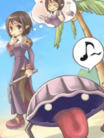

# Cmd1 - Pwnable.kr



```
Mommy! what is PATH environment in Linux?
```

cmd1.c:
```c
#include <stdio.h>
#include <string.h>

int filter(char* cmd){
        int r=0;
        r += strstr(cmd, "flag")!=0;
        r += strstr(cmd, "sh")!=0;
        r += strstr(cmd, "tmp")!=0;
        return r;
}
int main(int argc, char* argv[], char** envp){
        putenv("PATH=/thankyouverymuch");
        if(filter(argv[1])) return 0;
        system( argv[1] );
        return 0;
}
```

## The Code

The filter function is using [strstr()](https://man7.org/linux/man-pages/man3/strstr.3.html) to find occurrences of the words "flag", "sh", and "tmp". For each occurrence that is found 1 is added to the variable ```r```. ```r``` is then returned.

In the main function, [putenv()](https://man7.org/linux/man-pages/man3/putenv.3.html) is used to change the value of the [PATH](https://en.wikipedia.org/wiki/PATH_(variable)) to ```/thankyouverymuch```. The program exists if there are any occurrences of "flag", "sh", or "tmp" in the first argument. Finally, the first argument is [executed](https://man7.org/linux/man-pages/man3/system.3.html).

## Solution

We need to find some command to run that will show us the contents of the flag file, while the PATH is set to ```/thankyouverymuch```.

We'll have to use an [absolute path](https://en.wikipedia.org/wiki/Path_(computing)#Absolute_and_relative_paths) for our command, because the PATH has been wiped. We'll also have to avoid using the banned keywords. Keep in mind that we can use [quotation marks](https://stackoverflow.com/questions/30519252/quotes-and-argv-in-c-c/30519296) to use spaces in our command as well.

This meets all of the requirements:
```
cmd1@pwnable:~$ ./cmd1 '/bin/cat /home/cmd1/fla*'
mommy now I get what PATH environment is for :)
```
