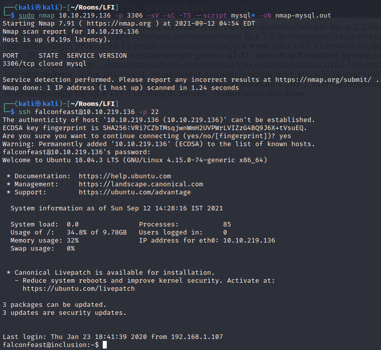

# LFI


```
# Nmap 7.91 scan initiated Sun Sep 12 04:30:15 2021 as: nmap -T5 -sC -sV -v -Pn -oN nmap.out 10.10.219.136
Nmap scan report for 10.10.219.136
Host is up (0.20s latency).
Not shown: 998 closed ports
PORT   STATE SERVICE VERSION
22/tcp open  ssh     OpenSSH 7.6p1 Ubuntu 4ubuntu0.3 (Ubuntu Linux; protocol 2.0)
| ssh-hostkey: 
|   2048 e6:3a:2e:37:2b:35:fb:47:ca:90:30:d2:14:1c:6c:50 (RSA)
|   256 73:1d:17:93:80:31:4f:8a:d5:71:cb:ba:70:63:38:04 (ECDSA)
|_  256 d3:52:31:e8:78:1b:a6:84:db:9b:23:86:f0:1f:31:2a (ED25519)
80/tcp open  http    Werkzeug httpd 0.16.0 (Python 3.6.9)
| http-methods: 
|_  Supported Methods: OPTIONS GET HEAD
|_http-title: My blog
Service Info: OS: Linux; CPE: cpe:/o:linux:linux_kernel

Read data files from: /usr/bin/../share/nmap
Service detection performed. Please report any incorrect results at https://nmap.org/submit/ .
# Nmap done at Sun Sep 12 04:30:32 2021 -- 1 IP address (1 host up) scanned in 16.29 seconds

```

LFI stands for [Local File Inclusion](https://en.wikipedia.org/wiki/File_inclusion_vulnerability#Local_file_inclusion). This essentially means that the webserver is allowing us to view files we shouldn't be able to. Here is the website running on port 80:


When we click on one of these websites, we can see that the post we're currently viewing is reflected in the ```name``` query string.


Because of the way this is formatted, the site is probably just showing a local file. Let's try exploiting LFI, and grab the /etc/passwd:


The most interesting things about this are the credentials listed for the falconfeast user: ```falconfeast:rootpassword``` 

Since we know that SSH is running on the box, we can use this to login.



Success! Here we can find the user flag:


Since "sudo" is one of the tags on this box, I'll check what commands our user is allowed to run on sudo without a password:


This means that we can run ```socat``` with root perms. [GTFObins](https://gtfobins.github.io/gtfobins/socat/) will cover the rest.

