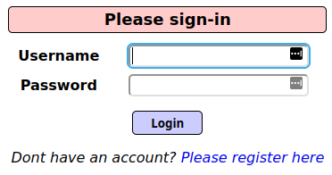
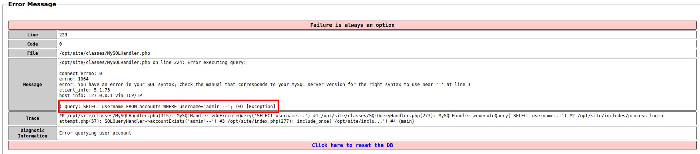
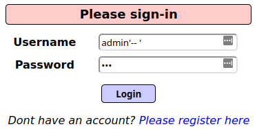
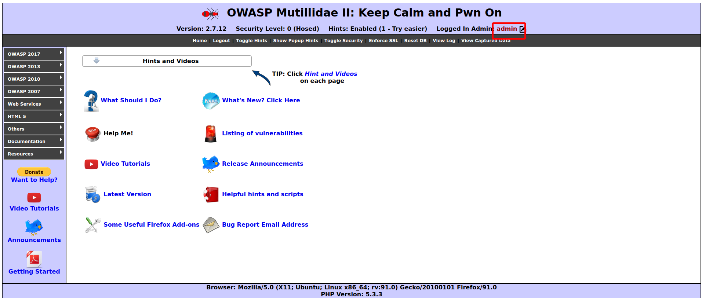

# Login - OWASP Mutillidae

From [OWASP Mutillidae](https://github.com/webpwnized/mutillidae) seen on [HackAndWin](https://hackandwin.com/)



This login page is vulnerable to [SQL injection](https://owasp.org/www-community/attacks/SQL_Injection).

I'd rather just start testing than spend time auditing the code, since there probably isn't a very high bar for this SQL injection. To check for any SQLi I'll start off by trying the user name "admin'--" and the password "aaa"



This error is helpful, and tells us that the website is running [mySQL](https://www.mysql.com/) and that we were able to insert a SQL comment. This is the query that was executed:

```mysql
) Query: SELECT username FROM accounts WHERE username='admin'--'; (0) [Exception] 
```

This query caused an exception because of the odd number of commas. Since the website is already wrapping up our input in two commas, adding a second comma after our comment (the --) would mean that there is an even number of comments (making our query valid) and should cause the comment to be run, and thus cause the rest of the query (the password check) to be evaluated to true.

Lo and behold, this works!




